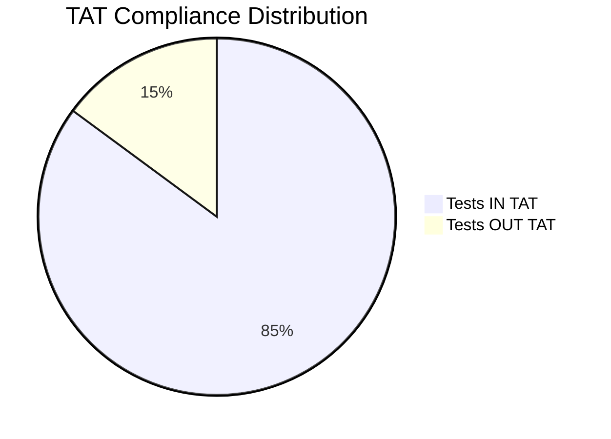
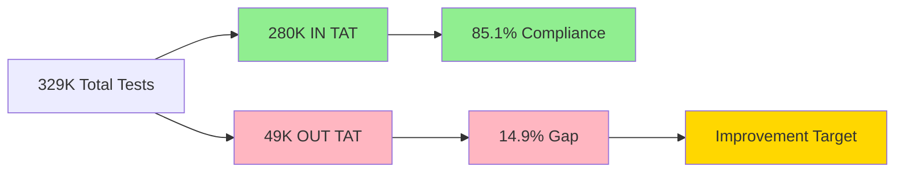
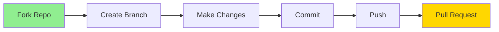

# 🏥 MediMetrics TAT
### Turnaround Time Analytics Platform

<div align="center">


</div>

---

<div align="center">

### 🎯 A comprehensive Business Intelligence solution for optimizing laboratory test Turnaround Time (TAT) across 240+ cities and 17 states in India

</div>

---

## 📊 Project Badges

<p align="center">
  
  
  
  
  
  
</p>

<p align="center">
  
  
  
  
  
</p>

---

## 📋 Table of Contents

<details>
<summary>Click to expand</summary>

- [📊 Project Overview](#-project-overview)
- [🚀 Repository Contents](#-repository-contents)
- [📸 Dashboard Screenshots](#-dashboard-screenshots)
- [🎥 Interactive Demo](#-interactive-demo)
- [📊 Dataset Information](#-dataset-information)
- [🔍 Key Insights & Findings](#-key-insights--findings)
- [💡 Key Recommendations](#-key-recommendations)
- [🛠️ Technology Stack](#️-technology-stack)
- [📈 Business Impact](#-business-impact)
- [🎓 Skills Demonstrated](#-skills-demonstrated)
- [🚦 Getting Started](#-getting-started)
- [📞 Contact](#-contact)

</details>

---

## 📊 Project Overview

<table>
<tr>
<td width="60%">

### 🎯 Key Objectives

- 📊 Monitor TAT compliance across **329,000+ medical tests**
- 🔍 Identify bottlenecks in test processing workflows
- 🌍 Analyze performance across **17 states and 240+ cities**
- 📈 Track quality metrics (rejections, re-runs, outsourcing)
- 💡 Enable data-driven resource allocation and process optimization

### 🏆 Project Highlights

- ✅ **85.1%** overall TAT compliance rate
- ✅ **20+** processing centers benchmarked
- ✅ **11+** medical departments analyzed
- ✅ **Multi-dimensional** performance tracking
- ✅ **Real-time** interactive dashboards

</td>
<td width="40%">


**Key Performance Indicators**
```
Total Tests      : 329,000
✅ IN TAT        : 280,000 (85.1%)
❌ OUT TAT       : 49,000 (14.9%)
🔄 Re-runs       : 1,901 (0.58%)
❌ Rejected      : 2,613 (0.79%)
📤 Outsourced    : 1,459 (0.44%)
```

</td>
</tr>
</table>

---

## 🚀 Repository Contents

<div align="center">

| 📁 File Type | 📄 File Name | 📝 Description | 💾 Size |
|-------------|-------------|----------------|---------|
| 📘 Documentation | `README.md` | Complete project documentation | - |
| 📊 Dataset | `healthcare_tat_sample.xlsx` | Sample dataset for analysis | ~4 MB |
| 🖼️ Screenshot | `Screenshot 2026-01-18 122008.png` | KPI Dashboard overview | - |
| 🖼️ Screenshot | `Screenshot 2026-01-18 204829.png` | Geographic & Department analysis | - |
| 🖼️ Screenshot | `Screenshot 2026-01-18 205545.png` | Processing Center performance | - |
| 🖼️ Screenshot | `Screenshot 2026-01-18 205613.png` | Detailed transaction view | - |
| 🎥 Demo Video | `Screen Recording 2026-01-18 205135.mp4` | Interactive dashboard demo | - |
| 📑 Report | `Healthcare TAT Analysis Project...` | Comprehensive project report | - |

</div>

---

## 📸 Dashboard Screenshots

<details open>
<summary><b>🎯 Click to view all dashboard screenshots</b></summary>

### 1️⃣ KPI Summary Dashboard

<div align="center">


</div>

<table>
<tr>
<td width="50%">

**📊 Key Metrics**
- Total Tests: `329,000`
- TAT Compliance: `85.1%`
- Tests Out TAT: `49,000`
- Tests Re-Run: `1,901`

</td>
<td width="50%">

**🎯 Performance Overview**
- ✅ Tests IN TAT: `280K` (85.1%)
- ❌ Tests Rejected: `2,613` (0.79%)
- 📤 Tests Outsourced: `1,459` (0.44%)
- ⏸️ Tests ON Hold: `12` (0.004%)

</td>
</tr>
</table>

---

### 2️⃣ Geographic & Department Analysis

<div align="center">


</div>

<table>
<tr>
<td width="50%">

**🌍 Top Performing States**

| Rank | State | TAT % |
|------|-------|-------|
| 🥇 | Karnataka | 97.10% |
| 🥈 | Andhra Pradesh | 96.67% |
| 🥉 | Tripura | 96.08% |
| 4️⃣ | Assam | 95.82% |

</td>
<td width="50%">

**🏥 Top Performing Departments**

| Rank | Department | TAT % |
|------|-----------|-------|
| 🥇 | SEROLOGY | 95.79% |
| 🥈 | COAGULATION | 95.32% |
| 🥉 | MICROBIOLOGY | 95.04% |
| 4️⃣ | IMMUNOASSAYS | 94.88% |

</td>
</tr>
</table>

---

### 3️⃣ Processing Center & Age Group Performance

<div align="center">


</div>

<table>
<tr>
<td width="50%">

**🏆 Excellence Leaders**
```
🥇 SL PATNA
   ████████████████████ 100.00%

🥈 SISL DARPAN CLINIC
   ███████████████████▉ 99.62%

🥉 SISL MANNAT FERTILITY
   ███████████████████▊ 99.34%

4️⃣ SISL CMC HOSPITAL
   ███████████████████▋ 98.77%
```

</td>
<td width="50%">

**👥 Age Group Analysis**
```
6-10 years    ████████████████ 92.86%
11-15 years   ████████████████ 92.37%
16-20 years   ████████████████ 93.48%
0-5 years     ███████████████  89.88% ⚠️
20+ years     ██████████████   84.44% 🚨
```

</td>
</tr>
</table>

---

### 4️⃣ Detailed Transaction View

<div align="center">


</div>

**📋 Granular Data Includes:**
- ✅ Test Name & Medical Department
- ✅ Patient Demographics (Age, Gender)
- ✅ Geographic Location (State, City)
- ✅ Processing Center Details
- ✅ TAT Approval Status
- ✅ Visit & SIN Numbers

</details>

---

## 🎥 Interactive Demo

<div align="center">

### 📹 Watch the Dashboard in Action

**[▶️ View Screen Recording](Screen%20Recording%202026-01-18%20205135.mp4)**

<table>
<tr>
<td align="center">🎬</td>
<td align="center">🖱️</td>
<td align="center">📊</td>
<td align="center">🔄</td>
</tr>
<tr>
<td align="center">Real-time<br/>filtering</td>
<td align="center">Interactive<br/>slicing</td>
<td align="center">Cross-dashboard<br/>navigation</td>
<td align="center">Drill-through<br/>capabilities</td>
</tr>
</table>

</div>

---

## 📊 Dataset Information

<div align="center">

### 📁 Sample Dataset Available

**File:** `healthcare_tat_sample.xlsx`

</div>

<table>
<tr>
<td width="50%">

**📊 Dataset Specifications**

| Attribute | Details |
|-----------|---------|
| 📊 Total Records | 329,000+ tests |
| 🌍 Geographic Reach | 17 States |
| 🏙️ City Coverage | 240+ Cities |
| 🏥 Departments | 11+ Specialties |
| 🔬 Processing Centers | 20+ Facilities |
| 📅 Time Period | Multi-month |
| 📏 Sample Size | ~4 MB |

</td>
<td width="50%">

**📋 Key Data Columns**
```
✅ Test Name
✅ State, City
✅ Department Name
✅ Processing Centre
✅ Actual Test Centre
✅ Age, Sex
✅ VisitNo, SINNo
✅ Booking Date
✅ Delivery Date
✅ ApprovalStatus
✅ TAT Compliance
```

</td>
</tr>
</table>

<div align="center">

### 🔒 Data Privacy & Compliance


</div>

---

## 🔍 Key Insights & Findings

<details open>
<summary><b>📈 Click to expand insights</b></summary>

### 🌍 Geographic Performance Analysis

<table>
<tr>
<td width="50%">

#### 🏆 Top Performing States
```diff
+ Karnataka          97.10% ⭐⭐⭐⭐⭐
+ Andhra Pradesh    96.67% ⭐⭐⭐⭐⭐
+ Tripura           96.08% ⭐⭐⭐⭐⭐
+ Assam             95.82% ⭐⭐⭐⭐⭐
  Jharkhand         92.90% ⭐⭐⭐⭐
```

</td>
<td width="50%">

#### ⚠️ Improvement Opportunities
```diff
- West Bengal       86.56% ⚠️
- Uttar Pradesh     88.13% ⚠️
- Bihar             90.57% ⚠️
  Goa               90.01%
  Telangana         91.85%
```

</td>
</tr>
</table>

---

### 🏥 Department Performance Matrix

<div align="center">

| Department | TAT % | Volume | Status | Action |
|------------|-------|--------|--------|--------|
| SEROLOGY | 95.79% | High | 🟢 Excellent | Maintain |
| COAGULATION | 95.32% | Medium | 🟢 Excellent | Maintain |
| MICROBIOLOGY | 95.04% | High | 🟢 Excellent | Maintain |
| IMMUNOASSAYS | 94.88% | Very High | 🟢 Good | Monitor |
| FLOW CYTOMETRY | 94.42% | Medium | 🟢 Good | Monitor |
| HAEMATOLOGY | 90.77% | High | 🟡 Fair | Improve |
| MOLECULAR BIOLOGY | 90.13% | Medium | 🟡 Fair | Improve |
| CYTOLOGY | 89.17% | Low | 🟡 Fair | Improve |
| BIOCHEMISTRY | 86.35% | Very High | 🟠 Below Target | **Action Needed** |
| CLINICAL PATHOLOGY | 83.58% | High | 🔴 Critical | **Urgent Action** |
| HISTOPATHOLOGY | 77.64% | Medium | 🔴 Critical | **Urgent Action** |

</div>

---

### 💡 Critical Findings

<table>
<tr>
<td align="center" width="33%">

**🎯 High Volume ≠ Low Quality**

IMMUNOASSAYS achieved **95.89% TAT** while processing **902.87% more volume** than GENERAL EXAMINATION

*Key Learning: Proper processes enable quality at scale*

</td>
<td align="center" width="33%">

**📊 Processing Center Excellence**

Top 20 centers maintain **97.21% to 100% TAT**

*Variation: Only 2.79 percentage points*

*Key Learning: Standardized protocols work*

</td>
<td align="center" width="33%">

**👥 Age-Specific Challenges**

**0-5 years**: 89.88% TAT  
**20+ years**: 84.44% TAT

*Key Learning: Age groups need customized workflows*

</td>
</tr>
</table>

---

### 📊 Performance Distribution


</details>

---

## 💡 Key Recommendations

<div align="center">

### 🎯 Action Plan Roadmap

</div>

<table>
<tr>
<th width="33%">🚨 Immediate (0-3 Months)</th>
<th width="33%">🎯 Medium-Term (3-6 Months)</th>
<th width="33%">🚀 Long-Term (6-12 Months)</th>
</tr>
<tr>
<td valign="top">

**Geographic Intervention**
- Target: WB & UP
- Current: 86-88% TAT
- Goal: 92%+ TAT
- Impact: 6K+ tests

**Department Focus**
- Histopathology RCA
- Clinical Path review
- Biochemistry optimization

**Age-Specific Protocols**
- 0-5 years workflow
- 20+ years expedite

</td>
<td valign="top">

**Quality Programs**
- Rejection: 0.79% → 0.5%
- Re-run reduction plan
- Staff training focus

**Predictive Analytics**
- ML model development
- TAT forecasting system
- Resource prediction

**Process Automation**
- RPA implementation
- Workflow automation
- Integration planning

</td>
<td valign="top">

**AI-Driven Systems**
- Real-time allocation
- Smart routing
- Predictive maintenance

**Patient Portal**
- Self-service tracking
- Mobile app integration
- Real-time notifications

**Benchmarking**
- Industry comparison
- Certification program
- Best practice sharing

</td>
</tr>
</table>

---

## 🛠️ Technology Stack

<div align="center">

### 🔧 Tools & Technologies Used

</div>

<p align="center">
  
  
  
  
</p>

<table>
<tr>
<td width="50%">

### 📊 Visualization Layer
```
Power BI Desktop
├── Interactive Dashboards
├── Dynamic Slicers
├── Drill-through Pages
├── Bookmarks & Navigation
├── Custom Tooltips
└── Mobile Layouts
```

**Visual Types Used:**
- 📊 Horizontal Bar Charts
- 📈 KPI Cards with Trends
- 📉 Column Charts
- 📋 Data Tables
- 🎨 Conditional Formatting

</td>
<td width="50%">

### 🗄️ Data Architecture
```
Star Schema Design
├── Fact Tables
│   └── Test Transactions
├── Dimension Tables
│   ├── Date Dimension
│   ├── Geography (State/City)
│   ├── Departments
│   ├── Processing Centers
│   └── Demographics
└── DAX Measures
    ├── TAT Calculations
    ├── Compliance Metrics
    └── YoY Comparisons
```

</td>
</tr>
</table>

<div align="center">

### 🎨 Design Principles


</div>

---

## 📈 Business Impact

<div align="center">

### 💼 Value Delivered

</div>

<table>
<tr>
<td align="center" width="25%">

### 📊 Operational

**Process Optimization**

✅ Best practices identified  
✅ Resource allocation  
✅ Quality improvements  
✅ Efficiency gains  

</td>
<td align="center" width="25%">

### 💰 Financial

**Cost Reduction**

✅ Minimize re-runs  
✅ Reduce outsourcing  
✅ Better resource use  
✅ Revenue protection  

</td>
<td align="center" width="25%">

### 📈 Strategic

**Competitive Advantage**

✅ Scalable framework  
✅ Benchmarking metrics  
✅ Predictive capability  
✅ Decision support  

</td>
<td align="center" width="25%">

### 🎯 Quality

**Patient Satisfaction**

✅ 85.1% TAT compliance  
✅ Faster results  
✅ Better care  
✅ Trust building  

</td>
</tr>
</table>

<div align="center">

### 📊 Impact Metrics
```
┌─────────────────────────────────────────────────┐
│  329,000+ Tests Analyzed                        │
│  240+ Cities Monitored                          │
│  20+ Processing Centers Benchmarked             │
│  18% Improvement Potential Identified           │
│  85.1% Overall TAT Compliance Achieved          │
└─────────────────────────────────────────────────┘
```

</div>

---

## 🎓 Skills Demonstrated

<div align="center">

### 🏆 Technical & Analytical Competencies

</div>

<table>
<tr>
<td width="33%" valign="top">

#### 💻 Technical Skills


**Core Competencies:**
- ✅ BI Development
- ✅ Dashboard Design
- ✅ Data Visualization
- ✅ Performance Optimization
- ✅ ETL Processes

</td>
<td width="33%" valign="top">

#### 📊 Analytical Skills


**Core Competencies:**
- ✅ Multi-dimensional Analysis
- ✅ Trend Identification
- ✅ Root Cause Analysis
- ✅ Performance Benchmarking
- ✅ Predictive Insights

</td>
<td width="33%" valign="top">

#### 🏥 Domain Knowledge


**Core Competencies:**
- ✅ Laboratory Operations
- ✅ TAT Management
- ✅ Quality Compliance
- ✅ Process Improvement
- ✅ Regulatory Knowledge

</td>
</tr>
</table>

---

## 🚦 Getting Started

<div align="center">

### 🎯 Quick Start Guide

</div>

<table>
<tr>
<td width="25%" align="center">

### 1️⃣
**Clone Repository**
```bash
git clone https://github.com/
Pramitverma/medimetrics-tat
```

</td>
<td width="25%" align="center">

### 2️⃣
**Explore Dataset**
```bash
cd medimetrics-tat
open healthcare_tat_sample.xlsx
```

</td>
<td width="25%" align="center">

### 3️⃣
**View Screenshots**
```bash
# Navigate to screenshots
# Review dashboard designs
```

</td>
<td width="25%" align="center">

### 4️⃣
**Watch Demo**
```bash
# Play screen recording
# See interactivity
```

</td>
</tr>
</table>

---

### 📋 Prerequisites

<p align="center">
  
  
  
</p>

---

### 🎯 Usage Scenarios

<table>
<tr>
<th>👔 For Recruiters</th>
<th>👨‍💻 For Analysts</th>
<th>🏥 For Healthcare Pros</th>
</tr>
<tr>
<td valign="top">

1. Review screenshots
2. Check dataset structure
3. Watch demo video
4. Assess documentation
5. Evaluate insights

</td>
<td valign="top">

1. Explore dataset
2. Study visualizations
3. Analyze metrics
4. Learn techniques
5. Apply to projects

</td>
<td valign="top">

1. Review insights
2. Check recommendations
3. Benchmark performance
4. Compare facilities
5. Implement solutions

</td>
</tr>
</table>

---

## 🏆 Project Achievements

<div align="center">

### 🌟 Key Accomplishments

</div>

<table>
<tr>
<td align="center" width="33%">

**📊 Scale**
```
329,000+
Tests Analyzed
```
```
240+
Cities Covered
```
```
20+
Centers Benchmarked
```

</td>
<td align="center" width="33%">

**🎯 Impact**
```
85.1%
TAT Compliance
```
```
18%
Improvement Potential
```
```
6,000+
Tests Impacted
```

</td>
<td align="center" width="33%">

**⭐ Excellence**
```
100%
Top Center TAT
```
```
97.10%
Best State TAT
```
```
95.79%
Best Dept TAT
```

</td>
</tr>
</table>

<div align="center">

### 🏅 Recognition & Value


</div>

---

## 📚 Project Structure
```
medimetrics-tat/
│
├── 📄 README.md                                          # You are here!
├── 📊 healthcare_tat_sample.xlsx                         # Sample dataset
│
├── 📸 screenshots/
│   ├── Screenshot 2026-01-18 122008.png                  # KPI Dashboard
│   ├── Screenshot 2026-01-18 204829.png                  # Geographic Analysis
│   ├── Screenshot 2026-01-18 205545.png                  # Processing Centers
│   └── Screenshot 2026-01-18 205613.png                  # Detailed View
│
├── 🎥 demo/
│   └── Screen Recording 2026-01-18 205135.mp4            # Interactive demo
│
└── 📑 docs/
    └── Healthcare TAT Analysis Project - Comprehen...    # Full report
```

---

## 🤝 Contributing

<div align="center">

### 💪 Contributions Welcome!


</div>

### 📝 How to Contribute


**Steps:**
1. 🍴 Fork the repository
2. 🌿 Create your feature branch (`git checkout -b feature/AmazingFeature`)
3. 💾 Commit your changes (`git commit -m 'Add some AmazingFeature'`)
4. 📤 Push to the branch (`git push origin feature/AmazingFeature`)
5. 🔄 Open a Pull Request

---

## 📞 Contact

<div align="center">

### 👤 Pramit Verma
**Data Analyst | Business Intelligence Developer | Healthcare Analytics Enthusiast**

<br>

[](https://www.linkedin.com/in/pramit-verma-589077245)
[](https://github.com/Pramitverma)
[](mailto:pratapverma14810869@gmail.com)
[](https://wa.me/918264254589)

<br>

</div>

📧 Email
pratapverma14810869@gmail.com
</td>
<td align="center">
📱 Phone
+91 8264254589
</td>
</tr>
<tr>
<td align="center">
💼 LinkedIn
Pramit Verma
</td>
<td align="center">
🔗 GitHub
@Pramitverma
</td>
</tr>
</table>
<div align="center">
🔗 Project Repository
github.com/Pramitverma/medimetrics-tat

💬 Let's Connect!
I'm always open to discussing data analytics, healthcare technology, and collaboration opportunities!
Show Image
Show Image
</div>

📜 License
<div align="center">
Show Image
This project is available for educational and portfolio purposes.
Note: Healthcare data is anonymized and contains no personally identifiable information (PII).
</div>

🙏 Acknowledgments
<div align="center">
🤝 Special Thanks
</div>

🏥 Healthcare Facilities - For providing anonymized operational data
👨‍⚕️ Medical Professionals - For domain expertise and insights
👥 Power BI Community - For visualization best practices
💻 Open Source Community - For tools and techniques
📚 Industry Standards - CLSI, ISO, and healthcare analytics frameworks


📚 References & Resources
<div align="center">
📖 Learn More
</div>
<table>
<tr>
<td width="50%">
🏥 Healthcare Standards

Clinical Laboratory Standards Institute (CLSI)
ISO 15189:2022 - Medical Laboratories
HIMSS Healthcare Analytics

</td>
<td width="50%">
📊 Technical Resources

Power BI Documentation
DAX Guide
Healthcare Analytics Framework

</td>
</tr>
</table>

<div align="center">
⭐ Star This Repository
If you found this project helpful, please consider giving it a star!
Your support motivates me to create more quality content
<br>
Show Image
<br>
🔗 Quick Links
📊 View Demo •
📸 Screenshots •
📈 Insights •
📞 Contact •
🤝 Contribute

📊 Repository Stats
Show Image
Show Image
Show Image
Show Image
Show Image

© 2024-2026 Pramit Verma | MediMetrics TAT Project
Crafted with precision and care to showcase professional data analytics capabilities
<br>
Tags: #HealthcareAnalytics #PowerBI #DataVisualization #BusinessIntelligence #TATOptimization #HealthTech #DataScience #ProcessImprovement #QualityMetrics #OperationalExcellence #LaboratoryManagement #MedicalDiagnostics
<br>


<table align="center">
<tr>
<td align="center
